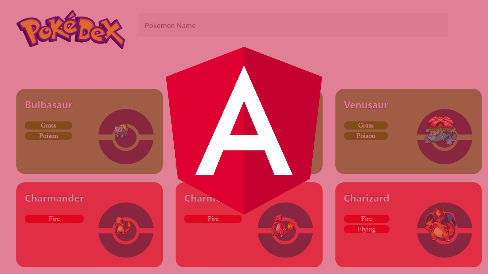

# PokeAngular Pokedex 🐾

Welcome to the PokeAngular Pokedex, an interactive and modern Pokedex built with Angular.

## About 📖

The PokeAngular Pokedex is a fun, interactive application for all Pokémon fans. The application utilizes the [PokeAPI](https://pokeapi.co/) to fetch data and provide detailed information about each Pokémon. 

The aim of this project was not only to create a functional Pokedex but also to gain more experience and learn more about Angular, TypeScript, and working with APIs.

You can check out the live project [here](https://doplaxpokeangular.netlify.app/).

## Features 🌟

- **List View:** See all Pokémon in a list view.
- **Search:** Search for a Pokémon by their name.
- **Detailed View:** Click on a Pokémon to see detailed information about them.

## How to Use 🕹️

Simply navigate to the [PokeAngular Pokedex](https://doplaxpokeangular.netlify.app/) and start exploring!

## Feedback 💌

Your feedback is always welcome! If you have any suggestions or want to make a contribution to the project, feel free to do so.

## Acknowledgements 🏆

This project was inspired by the love for Pokémon. Special thanks to [PokeAPI](https://pokeapi.co/) for providing the data used in this project.

Happy catching trainers! 🎉

---

Made with 💖 by [Doplax.Dev](https://doplax.dev/)
